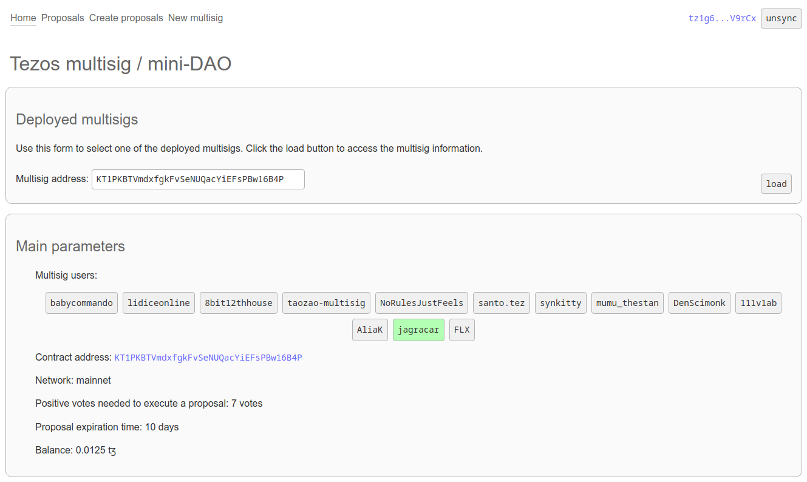
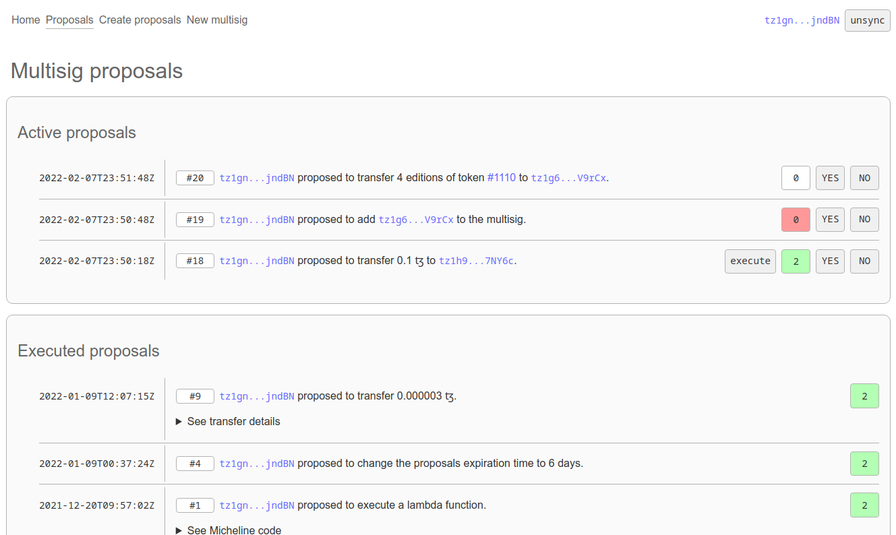
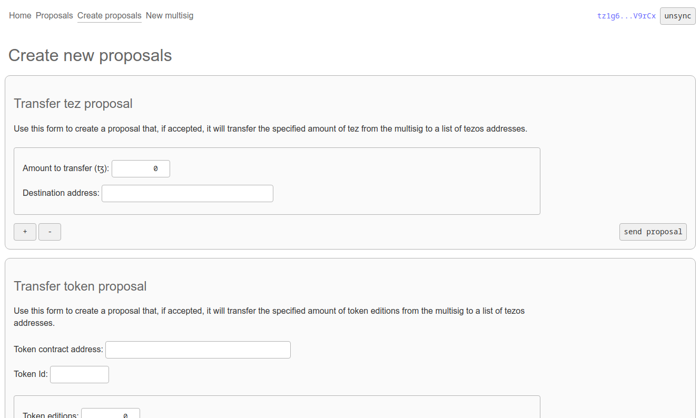

# Multisig documentation

## Background

The [Teia Community](https://twitter.com/TeiaCommunity) (at that time called the HEN Community) was
spontaneously formed the 12th of November 2021, just few hours after the [hic et nunc](https://hicetnunc.xyz) 
marketplace discontinuation. At that exact moment, it became clear that community decisions would
need to be taken in a distributed manner and that a single person should never again have the power to
shut down a site, modify the internal parameters of a critical smart contract or administer the platform fees.

Using a multisig wallet was proposed as a quick solution to manage the future [Teia marketplace](https://teia.art),
before a community [DAO](https://en.wikipedia.org/wiki/The_DAO_(organization)) was formed.
A [multisig wallet](https://tezos.gitlab.io/user/multisig.html#multi-signature-smart-contracts) is a smart contract 
that requires several signatures in order to execute transactions.

After some investigation, it was found that
[existing tezos solutions](https://tezos.gitlab.io/user/multisig.html#supported-versions-of-the-multisig-contract)
were mostly designed for people with good programming skills. This lead to the decision of developing a
basic multisig smart contract that would be easy to use and would incorporate some special features needed by the
Teia Community.

These were the main requirements for the Teia multisig:

 - Easy to use web interface vs. the console mode from previously existing solutions.
 - It should be possible to add and remove users to allow responsibility rotation.
 - It should be possible to modify the required quorum to execute transactions.
 - In addition to tez transactions, the multisig should be able to call other smart contracts.
   In particular, it should be able to administer the
   [Teia marketplace contract](https://github.com/teia-community/objkt-swap/blob/3.0.0/smart-py/marketplace.py)
   (update the fees, include new tokens to trade on the site, pause swaps and collects, and more).
 - User actions (votes) should be stored in the contract for future evaluation and archival purposes.

Based on these requirements, a small group of Teia Community members started to develop a multisig 
smart contract in the last days of November 2021. Few days later a prototype was deployed
to the tezos testnet, which was tested by voluntaries with different skills and backgrounds. 

On Decemeber 20th 2021, after many iterations, a final version of the Teia multisig smart contract
code and unit tests was sent to the [Inference](https://inference.ag) team to perform an independed
security audit.

The [audit](https://github.com/InferenceAG/ReportPublications/blob/master/Inference%20AG%20-%20Teia%20community%20-%20marketplace%20%26%20multisig%20-%20v1.0.pdf)
didn't find any major security issues, but suggested documentation improvements
and some small code changes to save in user transaction costs. The suggested changes were implemented
and the [final version](https://github.com/jagracar/tezos-smart-contracts/blob/main/python/contracts/multisignWalletContract.py)
of the Teia multisig was deployed to the tezos mainnet the 31st of January 2022.

Parallel to the audit, a basic [web interface](https://github.com/jagracar/multisign-app) was developed
to simplify the use of the multisig. After syncing their wallet, a user of the multisig can create
proposals to be voted by other multisig users, can vote other user-submitted proposals, and can execute
any proposal that has reached the required number of positive votes to be approved.

## General use case

As described before, the initial purpose of the Teia multisig was to facility the managing of the 
Teia marketplace smart contracts and fees. However, the multisig is general enough to be used in many
other situations:

 - A [NGO](https://en.wikipedia.org/wiki/Non-governmental_organization) could use a multisig to administer
   third party donations in a safe way.
 - A group of collectors could create a multisig to buy and sell [NFTs](https://en.wikipedia.org/wiki/Non-fungible_token).
 - A group of friends could use a multisig to vote their next holiday destination.

With the hope that it would be useful not only for the Teia Community artists and collectors, but also to the
tezos community as a whole, Teia has open sourced the code of the multisig smart contract and associated web
interface. Everybody is now free to create their own multisig wallet and to adapt it to their particular
needs.

Before creating (originating) a multisig, one has to decide the following:

 - How many users will be part of the multisig. A user is identified by their tezos wallet.
   In principle, there is no upper limit in the number of users the multisig can have, but the
   smart contract code is not designed to work with several thousand users. Less than 50
   users is recommended.
 - How many positive votes are required to approve proposals. This number should be higher
   than 1 and cannot exceed the total number of users in the multisig. The higher the number,
   the more difficult will be to approve proposals.
 - The proposal expiration time expressed in days after the proposal creation. If the time is 
   too short, proposals might not get approved, because some users might not have enough time
   to vote for them.

## Web interface

Once the multisig is deployed to the mainnet, users can interact with it using a [web interface](https://multisign.onrender.com/).

### Home page

At the home page one needs to select the correct multisig for a list of available options. After
loading it, the main multisig parameters are shown:

 - The list of multisig users. If the user is a member of the multisig and they have synced their wallet,
   they should see their name highlighted with a green background.
 - The multisig contract address. Clicking on it will open a tab to the [TzKt](https://tzkt.io/) contract information.
 - The minimum number of positive votes required to execute proposals.
 - The proposals expiration time.
 - The current multisig tez balance.

Any person can transfer tez to the multisig. They don't need to be a multisig user.
This allows third party donations and tez transfers from other contracts (e.g. the management
fee transfers sent by the Teia marketplace contract).

It is possible to use the any tezos wallet ([Temple](https://templewallet.com/), [Kukai](https://wallet.kukai.app/))
to transfer tez or NFTs to the multisig. Just use the multisig contract address as the receiver address.

### Proposals page

Clicking on the proposals tab one can access the information of all the submitted proposals.
They are distributed in three groups: active, executed and expired proposals.

Active proposals are those proposals that have not yet being executed and their expiration time
has not yet passed. These are the only proposals that users of the multisig can interact with.

Active proposals have `YES` and `NO` buttons that can be clicked for voting. 
Close to those buttons there is a counter with the number of positive votes that the proposal has
received so far. If the user has not voted the proposal, the background color will be white. 
If they voted `YES`, the background color will be green, and if they voted `NO` the background will be red.
Users can change their vote at any moment by clicking again on the `YES` and `NO` buttons.

Note that only positive votes (`YES` votes) are counted to decide if a proposal can be executed or
not. Negative votes have no effect, except to highlight the user strong disagreement with the proposal.
All votes are stored inside the smart contract and can always be inspected to see how controversial
a proposal was.

When an active proposal reaches the minimum number of positive votes, a new `execute` button appears.
This button can be clicked by any multisig user and will result in the execution of the proposal.

Once a proposal is executed, it cannot be voted or executed anymore. It leaves the active proposals
list and becomes part of the executed proposals list. In that list one can see which proposals have
been executed and the number of positive votes that they received.

Finally, the last proposal list shows those proposals that didn't reach the minimum number of votes
to be executed before their expiration time passed. An expired proposal cannot be voted anymore. 
However, it is always possible to resubmit an expired proposal and start the voting process again.

Each proposal can be identified by an unique id number. Ideally, before the voting process starts, 
proposals should be discussed between the multisig users via discord / twitter / email. The
proposal id should be used in the discussion to keep the connection with the voting in the multisig.

### Creating proposals

Multisig users can create new proposals at any time. To do it, they need to go to the create proposals
tab. This page contains a list of forms that can be used to submit new proposals.

These are the different proposals that the multisig supports:

- Transfer tez proposal. Use this proposal to transfer tez from the multisig to list of addresses.
  Each address can receive a different tez amount. Of course, the total tez amount should be smaller
  than the number of tez in the multisig at the time of execution.

- Transfer token proposal. With this proposal one can transfer editions of FA2 token owned by the multisig
  to a list of addresses. Each address can receive a different number of token editions.

- Text proposals. This proposal is used to approve a text that has no direct consequence on the
  multisig or any other smart contract. They are used to register the users support to a given proposal
  written in plain text and stored in IPFS. For example, a text proposal could ask to change some
  component on a website UI, decide on a dog name, or suggest that one multisig user buys bread at the
  bakery.

- Lambda function proposal. This is the most powerful of all proposals and at the same time the most
  complex and the one that requires more close inspection. The proposal consists on some Michelson code
  that will be executed once the proposal is approved. This proposal could be used to collect or swap NFTs,
  to update other contract parameters, to delegate the multisig tez to a baker or to vote in a DAO of
  which the multisig is a member. Since the proposal consist of pure Michelson code, it's important that users
  understand what the code is doing before voting YES to it.

- Add user proposal. One can use this proposal to add new users to the multisig.

- Remove user proposal. Same as the add user proposal, but to remove an existing user from the multisig.

- Minimum votes proposal. With this proposal one can increase or decrease the minimum of positive votes
  required to execute a proposal.
  
- Expiration time proposal. Use this proposal to change the proposals expiration time.

## Important considerations

- Choose well the number of users and the minimum votes to approve proposals. Imagine a multisig with only
  2 users where only one positive vote is needed to execute proposals. In that situation, one of the users
  could create a proposal to transfer all the tez to an account controlled by the user. On the other side,
  a multisig with two users an a minimum of 2 positive votes to execute proposals could get blocked if
  one of the users disappears or losses their wallet keys. In that case, it would be impossible to execute
  proposals and any tez or tokens in the multisig will become inaccessible.
  
  These kind of situations could be minimized adding more users to the multisig. A multisig with 9 users
  and a minimum of 5 positive votes to approve proposals, would make more difficult that a small group
  of users impose their proposals to the rest. At the same time, 4 user would need to loose their keys
  to block the multisig forever.
  
  Ideally inactive multisig users should be identified and removed from the multisig to avoid the problem
  of not being able to approve proposals.
  
- Any update in the multisig parameters will affect all active and expired proposals. One should always
  evaluate the unexpected consequences that changing the parameter could have on them.

  For example, reducing the expiration time from 5 to 2 days could set some active proposals as expired.
  Increasing it from 5 to 10 days could reactivate some expired proposals.
  
  Removing a user might make a multisig inoperable if the minimum number of positive votes is not reduced
  at the same time and there are a significant fraction of inactive users in the multisig. For example,
  a multisig with 4 users and 3 minimum positive votes to approve proposal, will become a 3 users multisig
  if one of the users is removed and will require that all vote yes to approve future proposals. If one
  of the users is not active, the multisig will be blocked.
  
  Increasing the number of positive votes to approve proposals could also block a multisig if many users
  are not active or loose their keys.

